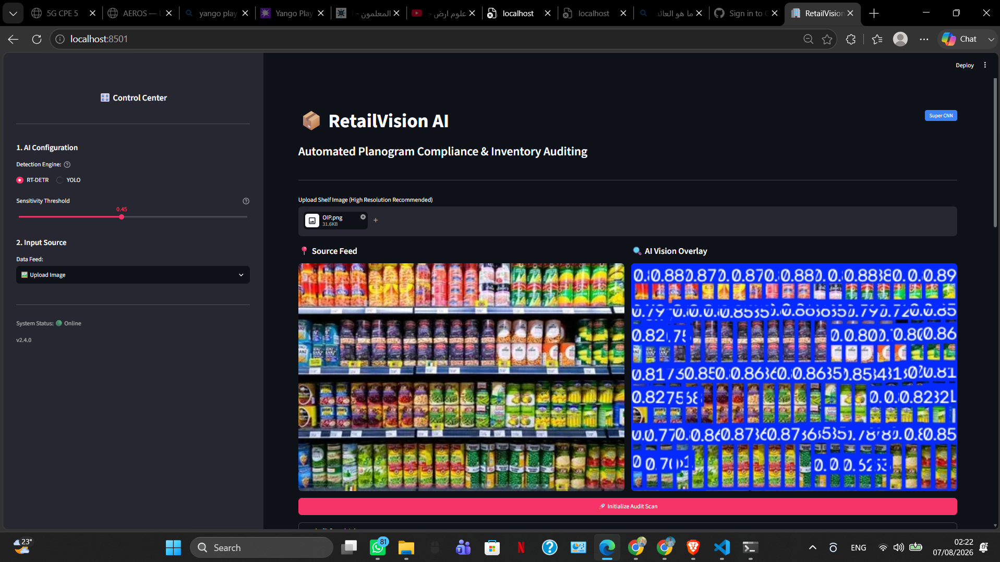
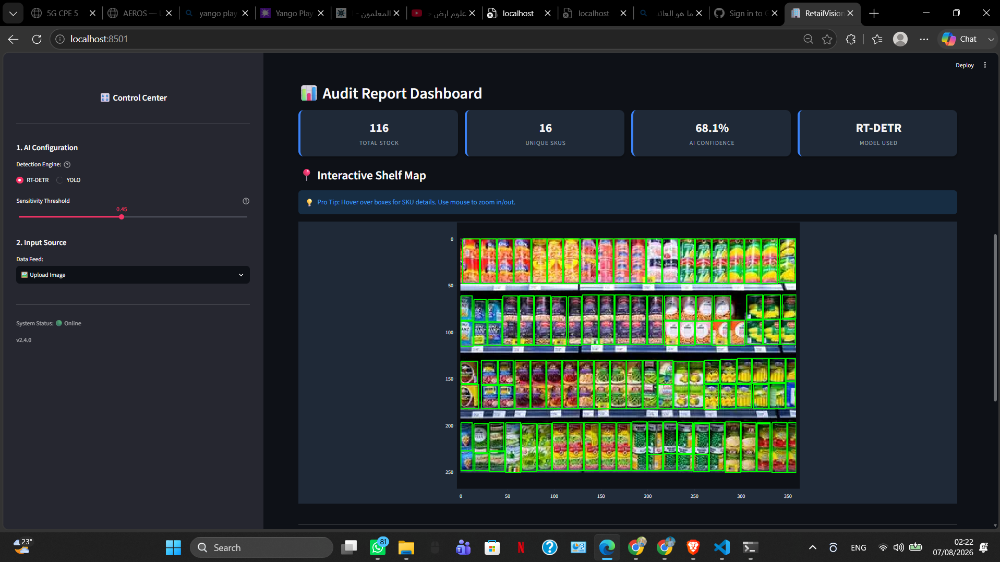
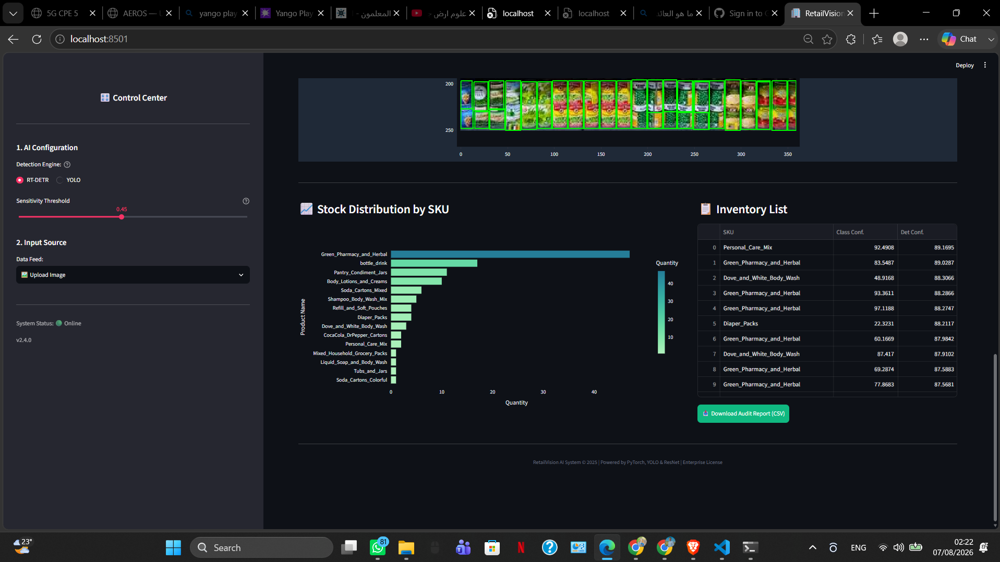

# 🛒 Retail Shelf Detection System

AI-powered retail shelf monitoring system for dense product detection and classification using **YOLOv8**, **RT-DETR**, **ResNet50**, and **Streamlit**.

---

## Overview

This project provides an end-to-end intelligent retail shelf analysis pipeline capable of:

- Detecting products on retail shelves
- Classifying detected products
- Comparing multiple detection models
- Running inference through an interactive Streamlit application

The system was developed as an academic Computer Vision project focusing on dense object detection in retail environments.

---

## Features

- Real-time product detection
- YOLOv8 detector
- RT-DETR detector
- ResNet50 product classification
- Interactive Streamlit interface
- Visual prediction outputs
- Model comparison

---

## Project Structure

```
retail-shelf-detection-system
│
├── app.py
├── utils.py
├── requirements.txt
│
├── models/
│
├── notebooks/
│   ├── train_yolo.ipynb
│   ├── train_rtdetr.ipynb
│   └── train_resnet50.ipynb
│
├── results/
│   ├── YOLO/
│   ├── RTDETR/
│   └── screenshots/
│
└── README.md
```

---

## Models Used

| Model | Purpose |
|--------|---------|
| YOLOv8 | Product Detection |
| RT-DETR | Dense Product Detection |
| ResNet50 | Product Classification |

---

## Installation

```bash
git clone https://github.com/AmmarAlrousan/retail-shelf-detection-system.git

cd retail-shelf-detection-system

pip install -r requirements.txt
```

---

## Run

```bash
streamlit run app.py
```

---

## Training

Training notebooks are available in:

```
notebooks/
```

including

- YOLOv8 training
- RT-DETR training
- ResNet50 training

---
## 📊 Model Performance

The project evaluates two state-of-the-art object detection models for dense retail shelf analysis.

| Metric | YOLOv8 | RT-DETR |
|--------|--------:|--------:|
| mAP@0.5 | **0.9359** | 0.9029 |
| mAP@0.5:0.95 | **0.6185** | 0.5933 |
| Precision | **0.9079** | 0.8793 |
| Recall | **0.8828** | 0.8702 |
| F1 Score | **0.8952** | 0.8748 |
| Inference Time | **38 ms** | 70 ms |

### Performance Summary

- ✅ YOLOv8 achieved the highest detection accuracy.
- ✅ RT-DETR produced competitive results with strong localization quality.
- ✅ YOLOv8 delivered the best balance between Precision and Recall.
- ✅ The Streamlit application allows switching between both models for comparison.
## Results

Evaluation results for both detection models are included in

```
results/
```

including

- Precision-Recall curves
- F1 curves
- Confusion matrices
- Validation predictions

---

## Technologies

- Python
- PyTorch
- Ultralytics
- RT-DETR
- OpenCV
- Streamlit
- ResNet50

---

## Future Improvements

- Multi-camera deployment
- Inventory estimation
- Product counting
- Shelf compliance monitoring
- Model optimization for edge devices

---
## 📸 Demo

### Home



---

### Dashboard



---

### Analytics


## License

MIT License
